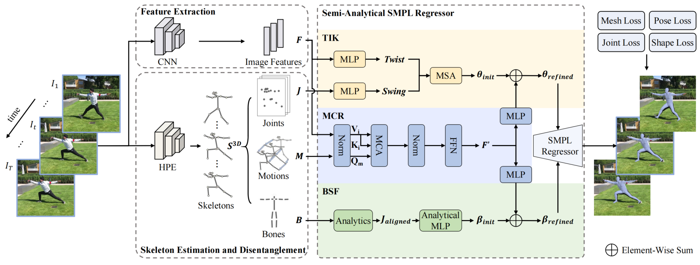

This is the offical Pytorch implementation of the paper:"
<div align="center">

  <h1 align="center">ARTS: Semi-Analytical Regressor using Disentangled Skeletal Representations for Human Mesh Recovery from Videos (ACM MM 2024)</h1>
</div>
<h4 align="center" style="text-decoration: none;">
  <a href="https://github.com/TangTao-PKU", target="_blank"><b>Tao Tang</b></a>,
  <a href="https://scholar.google.com/citations?hl=zh-CN&user=4CQKG8oAAAAJ", target="_blank"><b>Hong Liu</b></a>,
  <a href="https://kasvii.github.io/", target="_blank"><b>Yingxuan You</b></a>,
  <a href="https://scholar.google.com/citations?user=PjBAErYAAAAJ&hl=zh-CN&oi=sra", target="_blank"><b>Ti Wang</b></a>,
  <a href="https://vegetebird.github.io/", target="_blank"><b>Wenhao Li</b></a>,
</h4>
<h4 align="center">
  <a href="https://arxiv.org/pdf/2410.15582", target="_blank">arXiv</a> /
  <a href="https://dl.acm.org/doi/abs/10.1145/3664647.3680881", target="_blank">paper</a> 
</h4>

<p align="center">
     
</p>

<p align="center">
   
   
   
   
</p>


## Preparation

1. Install dependencies. This project is developed on Ubuntu 18.04 with NVIDIA 3090 GPUs. We recommend you to use an [Anaconda](https://www.anaconda.com/) virtual environment.
```bash
# Create a conda environment.
conda create -n arts python=3.8
conda activate arts

# Install PyTorch >= 1.2 according to your GPU driver.
conda install pytorch==1.10.0 torchvision==0.11.0 torchaudio==0.10.0 cudatoolkit=11.3 -c pytorch -c conda-forge

# Install other dependencies.
sh requirements.sh
```
2. Prepare SMPL layer. 
- For the SMPL layer, We used [smplpytorch](https://github.com/gulvarol/smplpytorch). The repo is already included in `./smplpytorch` folder.
- Download `basicModel_f_lbs_10_207_0_v1.0.0.pkl`, `basicModel_m_lbs_10_207_0_v1.0.0.pkl`, and `basicModel_neutral_lbs_10_207_0_v1.0.0.pkl` from [SMPL](https://smpl.is.tue.mpg.de/downloads) (female & male) and [SMPL](http://smplify.is.tue.mpg.de/) (neutral) to `./smplpytorch/smplpytorch/native/models`.

## Implementation
### Data Preparation
Rename the `./data_final` to the `./data`. And the `./data` directory structure should follow the below hierarchy. Download all the processed annotation files from [OneDrive](https://1drv.ms/f/s!Alg46BPWJg_XgVf-q5qKdkalhgOj?e=LmGZ8n)
```
${Project}  
|-- data  
|   |-- base_data
|   |   |-- J_regressor_extra.npy
|   |   |-- mesh_downsampling.npz
|   |   |-- smpl_mean_params.npz
|   |   |-- smpl_mean_vertices.npy
|   |   |-- SMPL_NEUTRAL.pkl
|   |   |-- spin_model_checkpoint.pth.tar
|   |-- COCO  
|   |   |-- coco_data  
|   |   |-- __init__.py
|   |   |-- dataset.py
|   |   |-- J_regressor_coco.npy
|   |-- Human36M  
|   |   |-- h36m_data  
|   |   |-- __init__.py
|   |   |-- dataset.py 
|   |   |-- J_regressor_h36m_correct.npy
|   |   |-- noise_stats.py
|   |-- MPII  
|   |   |-- mpii_data  
|   |   |-- __init__.py
|   |   |-- dataset.py
|   |-- MPII3D
|   |   |-- mpii3d_data  
|   |   |-- __init__.py
|   |   |-- dataset.py
|   |-- PW3D 
|   |   |-- pw3d_data
|   |   |-- __init__.py
|   |   |-- dataset.py
|   |-- multiple_datasets.py
```

### Train
Stage 1 : Train the 3D pose estimation.
```bash
# Human3.6M
bash train_pose_h36m.sh

# 3DPW
bash train_pose_3dpw.sh
```

Stage 2: To train the all network for final mesh. Configs of the experiments can be found and edited in `./config` folder. Change `posenet_path` in `./config/train_mesh_*.yml` to the path of the pre-trained pose model.
```bash
# Human3.6M
bash train_mesh_h36m.sh

# 3DPW & MPII3D
bash train_mesh_3dpw.sh
```

### Test
To test on a pre-trained pose estimation model (Stage 1).
```bash
# Human3.6M
bash test_pose_h36m.sh

# 3DPW
bash test_pose_3dpw.sh
```

To test on a pre-trained mesh model (Stage 2).
```bash
# Human3.6M
bash test_mesh_h36m.sh

# 3DPW
bash test_mesh_3dpw.sh

# MPII3D
bash test_mesh_mpii3d.sh
```
Change the `weight_path` in the corresponding `./config/test_*.yml` to your model path.

## Citation
Cite as below if you find this repository is helpful to your project:
```bibtex
@inproceedings{tang2024arts,
  title={ARTS: Semi-Analytical Regressor using Disentangled Skeletal Representations for Human Mesh Recovery from Videos},
  author={Tang, Tao and Liu, Hong and You, Yingxuan and Wang, Ti and Li, Wenhao},
  booktitle={Proceedings of the 32nd ACM International Conference on Multimedia},
  pages={1514--1523},
  year={2024}
}
```


## Acknowledgement
This repo is extended from the excellent work [PMCE](https://github.com/kasvii/PMCE), [Pose2Mesh](https://github.com/hongsukchoi/Pose2Mesh_RELEASE), [TCMR](https://github.com/hongsukchoi/TCMR_RELEASE). We thank the authors for releasing the codes.


